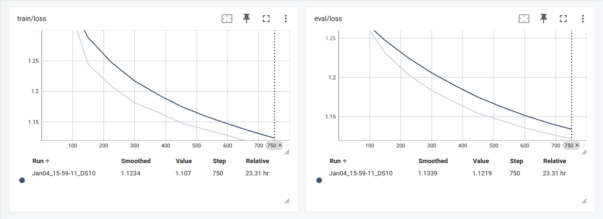

# Schaapje
Schaapje - A Dutch Small Language Model (SLM)

## Installation

For running SFT and DPO scripts on your local Linux host.

- Create a dedicated Python Virtual Environment
- Setup Pytorch 2.5.1 with CUDA 12.4: pip3 install torch torchvision torchaudio
- Run command: pip install -r requirements.txt

## V1.0

### Continual Pretraining
Schaapje V1.0 is based on the [IBM-Granite-3.0-2B-Instruct](https://huggingface.co/ibm-granite/granite-3.0-2b-instruct) Foundation Model.

This model was further continued pretrained on approximately 2.4 Billion tokens of the Dutch language based on 2 datasets:
- [yhavinga/mc4_nl_cleaned](https://huggingface.co/datasets/yhavinga/mc4_nl_cleaned)
- [Wikipedia Dutch](https://huggingface.co/datasets/wikimedia/wikipedia/viewer/20231101.nl)

The final script to create a HuggingFace private dataset for pretraining is:
- [prepare_pretraining_datasets.py](prepare_pretraining_datasets.py)

Google Colab Pro was used to perform the continued pretraining on the Dutch dataset with the following [Colab Notebook](Schaapje_2B_Pretrained.ipynb). The custom pretrained model can be found here: [Schaapje-2B-Pretrained](robinsmits/Schaapje-2B-Pretrained).

### SFT
In a second step this custom pretrained foundation model is further optimized for chat usage with Supervised FineTuning based on the Dutch chat dataset:
- [BramVanroy/ultrachat_200k_dutch](https://huggingface.co/datasets/BramVanroy/ultrachat_200k_dutch). 

The SFT is performed only on the Completions. This way the model will be usable for generic Dutch conversations. 

The Jupyter Notebook for SFT training:
- [Schaapje-2B-Chat-SFT-V1.0](Schaapje-2B-Chat-SFT-V1.0.ipynb)

The image below shows the train and validation loss.

### DPO
As a third and final step the SFT model will be further aligned for the Dutch language by training with DPO. 

The dataset used for DPO training is the Dutch DPO dataset:
- [BramVanroy/ultra_feedback_dutch_cleaned](https://huggingface.co/datasets/BramVanroy/ultra_feedback_dutch_cleaned). 

The Jupyter Notebook used for DPO training: 
- [Schaapje-2B-Chat-DPO-V1.0](Schaapje-2B-Chat-DPO-V1.0.ipynb)